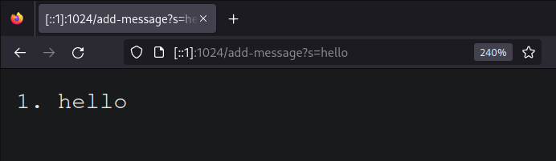
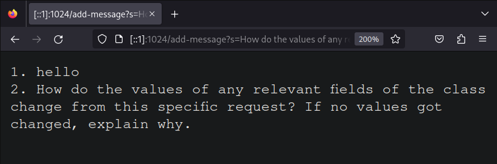
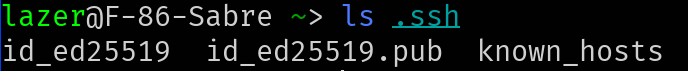
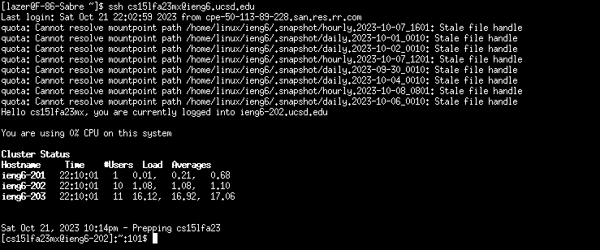

# Lab Report 2

Here is the code for `StringServer`
```java
import java.io.IOException;
import java.net.URI;
import java.util.*;

class Handler implements URLHandler {
    ArrayList<String> strings = new ArrayList<String>();

    public String handleRequest(URI url) {
        if (url.getPath().contains("/add-message")) {
            String[] parameters = url.getQuery().split("=");
            if (parameters[0].equals("s"))
                strings.add(parameters[1]);
        }
        StringBuilder b = new StringBuilder();
        for (int i = 0; i < strings.size(); ++i) {
            b.append(String.format("%d. %s\n", i + 1, strings.get(i)));
        }
        return b.toString();
    }
}

class StringServer {
    public static void main(String[] args) throws IOException {
        if(args.length == 0){
            System.out.println("Missing port number! Try any number between 1024 to 49151");
            return;
        }

        int port = Integer.parseInt(args[0]);

        Server.start(port, new Handler());
    }
}

```
---
## Using `/add-message`
For the following questions, `StringServer` only has one field that is relevant, being `strings`, which is of type `ArrayList<String>` 

- `handleRequest` method in my code is called.
- The argument that gets passes to `handleRequest` is of type `URI`, and it's value is of the url path and everything after, which in this case it would be "/add-message?s=hello". The value of the `strings` field is empty before the method gets called;
- `strings` changed by getting one string "hello" added to the array during the method `handleRequest`.


- `handleRequest` is called.
- The argument that gets passes to `handleRequest` is of type `URI`, and it's value is of the url path and everything after, which in this case it would be:
> /add-message?s=How%20do%20the%20values%20of%20any%20relevant%20fields%20of%20the%20class%20change%20from%20this%20specific%20request?%20If%20no%20values%20got%20changed,%20explain%20why.How%20do%20the%20values%20of%20any%20relevant%20fields%20of%20the%20class%20change%20from%20this%20specific%20request?%20If%20no%20values%20got%20changed,%20explain%20why.

There are "%20"s in the url because that is how the space character is encoded in url's. The value of the `strings` field contains one `String` "hello" before the method gets called;
- `strings` changed by getting one string
"How do the values of any relevant fields of the class change from this specific request? If no values got changed, explain why.How do the values of any relevant fields of the class change from this specific request? If no values got changed, explain why."
added to the array during the method `handleRequest`.

## Part 2

Screenshot of the path to the private key for your SSH key for logging into ieng6

The path to the private key is `/home/lazer/.ssh/id_ed25519`


---
Screenshot of the path to the public key for my SSH key for logging into ieng6 (within account on ieng6)

The path to the public key is `/home/linux/ieng6/cs15lfa23/cs15lfa23mx/.ssh/authorized_keys`


---
Screenshot of a terminal interaction where you log into ieng6 with your course-specific account without being asked for a password.


---
## Part 3
Two commands that I did not know about before are `scp` and `curl`. I knew about very similar commands, `cp` and `wget`, but it was interesting seeing the differences between them and their use cases, as `scp` is useful for copying files to remote computers and wget downloads to a file instead of showing the content in the terminal.