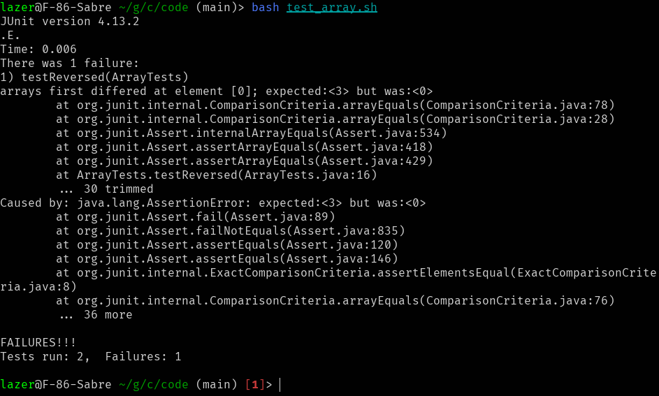

# Lab Report 3
# Part 1

The bug that I choose from lab 4 is the bug in the method `reversed`
## Failure inducing input
```java
@Test
public void testReversed() {
    int[] input2 = { 1, 2, 3 };
    assertArrayEquals(new int[]{ 3, 2, 1 }, Array.reversed(input2));
}
```
## An input that does not induce a failure
```java
@Test
public void testReversed2() {
    int[] input1 = { };
    assertArrayEquals(new int[]{ }, Array.reversed(input1));
}
```
## The symptom as the output of running the tests

## The bug
### Before
```java
static int[] reversed(int[] arr) {
    int[] newArray = new int[arr.length];
    for(int i = 0; i < arr.length; i += 1) {
        arr[i] = newArray[arr.length - i - 1]; // <-- here the arrays names should be swaped
    }
    return arr; // <-- here we should be returning the new array
}
```
### After
For this code I made two changes:
- switched the two arrays so that `newArray` is being set to the value from `arr`
- change the return value to return the new array `newArray`
```java
static int[] reversed(int[] arr) {
    int[] newArray = new int[arr.length];
    for(int i = 0; i < arr.length; i += 1) {
        newArray[i] = arr[arr.length - i - 1];
    }
    return newArray;
}
```
This change fixed the issue because we needed to return a *new* array, so we needed to return `newArray` instead of `arr`; we should have also been setting the values for `newArray` in the for loop, so that the `newArray` would be set properly as the reversed version of `arr`, so that is why swaping the two array names in the for loop fixed the bug.


# Part 2
For this part I choose to look at the `grep` command.

## `-n, --line-number`
Gives a line number for each match found.
### Example 1
command:
```sh
grep -n "finch" ./technical/*/*.txt
```

For this command it is searching through all the files that matched with `./technical/*/*.txt` to find a match of the expression "finch"; putting `-n` makes it so that not only will `grep` output the filenames and line, but also the line number for each match.

output:

    technical/biomed/1471-2105-3-2.txt:7:        Galapagos finches led to an appreciation of the structural
    technical/biomed/1471-2105-3-2.txt:10:        the finches' structural features was the foundation for his

### Example 2:
command:
```sh
grep -n "if (" ./technical/biomed/1471-2105-3-14.txt
```
For this command it is searching in the file `./technical/biomed/1471-2105-3-14.txt` to find a match of the expression "if ("; putting `-n` makes it so that not only will `grep` output the filenames and line, but also the line number for each match.

output:

    516:          if (sum of duplications in 
    542:          if (child 1 of 
    562:          if ( 
    573:          if ( 
    586:          if (M( 
    608:          if ( 
    612:          if (indicator of 
    625:          if (parent of 
    639:          if (parent of 


For each match that `grep` finds, this option also makes it so that the line number for where the match is found is printed. This option can be very useful when editing code, because in most code editors the line number is shown and it is quite easy to jump to the exact line you are looking for.

I found out about this option by using the `man` command.


## `-o, --only-matching`
Prints out only the part of the line that matched.

### Example 1
command:
```sh
grep -o "[0-9,\.]\+ times \w\+ likely" ./technical/*/*.txt
```

This command is searching for matches in every file that matches `./technical/*/*.txt` for any matches of the expression `[0-9,\.]\+ times \w\+ likely`, which is a regular expression that matches a number, then "times", then a word, then "likely". Putting `-o` shows only what matches this regular expression, instead of outputing the entire line of where the match was.

output:

    ./technical/biomed/1471-2458-2-6.txt:1.5 times more likely
    ./technical/biomed/1472-6947-2-4.txt:1.70 times more likely
    ./technical/biomed/gb-2003-4-7-r43.txt:22 times more likely


### Example 2:
command:
```sh
grep -o "mRNA is \w\{10\}\>" ./technical/*/*.txt
```

This command is searching for matches in every file that matches `./technical/*/*.txt` for any matches of the expression `mRNA is \w\{10\}\>`, which is a regular expression that matches a "mRNA is ", then a 10 letter word. Putting `-o` shows only what matches this regular expression, instead of outputing the entire line of where the match was.

output:

    ./technical/biomed/1471-213X-3-3.txt:mRNA is translated
    ./technical/biomed/1471-2105-2-8.txt:mRNA is nontrivial
    ./technical/biomed/1471-2156-3-11.txt:mRNA is restricted
    ./technical/biomed/1471-2164-4-24.txt:mRNA is detectable

For each match that `grep` finds, this option makes it so that only the part of the line that matched is shown. When doing more complicated patterns, it can be useful to see exactly what part of the file matched.

I found out about this option by using the `man` command.


## `-C, --context`
Gives a line number for each match found.

### Example 1
command:
```sh
grep -C 2 "U.S. Navy" ./technical/911report/chapter-6.txt
```

This command searches for the string "U.S. Navy" in the file `./technical/911report/chapter-6.txt`, but putting the `-C 2` option makes it so that not only does the line that contains the match get output, but also the 2 lines above and 2 lines below.

output:

    in the port of Aden, but the attempt failed when the suicide boat sank. More than
    nine months later, on October 12,2000, al Qaeda operatives in a small boat laden
    with explosives attacked a U.S. Navy destroyer, the USS Cole. The blast ripped a
    hole in the side of the Cole, killing 17 members of the ship's crew and wounding at
    least 40.


### Example 2:
command:
```sh
grep -C 1 "java\>" ./technical/*/*.txt
```

This command searches for the word "java" with a space after in all the files that match `./technical/*/*.txt`, but putting the `-C 1` option makes it so that not only does the line that contains the match get output, but also the 1 line above and 1 line below.

output:

    ./technical/biomed/1471-2105-3-12.txt-            prematurely. An error message "An internal error has
    ./technical/biomed/1471-2105-3-12.txt:            occurred. Please try again later java lang.NullPointer
    ./technical/biomed/1471-2105-3-12.txt-            Exception." will be displayed. Also, entering incorrect
    --
    ./technical/biomed/1471-2105-4-25.txt-          dynamically-generated web pages and takes advantage of
    ./technical/biomed/1471-2105-4-25.txt:          the java technology provided by the Apache Tomcat server
    ./technical/biomed/1471-2105-4-25.txt-          http://jakarta.apache.org/tomcat. Figure 4contains a


This option takes a number as input and adds that number of extra lines before and after each match, to give context for where the match is. This is useful because you might also want to see the lines around the match if the line of where the match is is similar to other lines.

I found out about this option by using the `man` command.


## `-l, --files-with-matches`
Prints out the name of each input file instead of the normal output

### Example 1
command:
```sh
grep -l "Feynman" ./technical/*/*.txt
```

This command searches for the word "Feynman" in all the files that match `./technical/*/*.txt`, but having the `-l` option makes it so that only the file path from the files that match get output from the command.

output:

    ./technical/plos/journal.pbio.0020073.txt


### Example 2:
command:
```sh
grep -l "Nazi" ./technical/*/*.txt
```

This command searches for the word "Nazi" in all the files that match `./technical/*/*.txt`, but having the `-l` option makes it so that only the file path from the files that match get output from the command.

output:

    ./technical/911report/chapter-3.txt
    ./technical/plos/pmed.0020235.txt


This option makes it so that `grep` only prints the files that contained a match. This option can be useful if you only really care about the files that contained a match, and can also be very useful as input to other commands that take file paths.

I found out about this option by using the `man` command.
