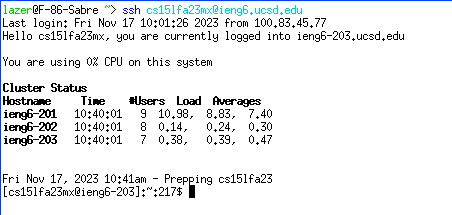
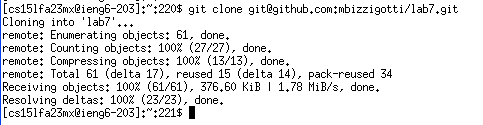
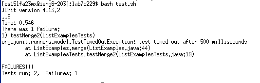
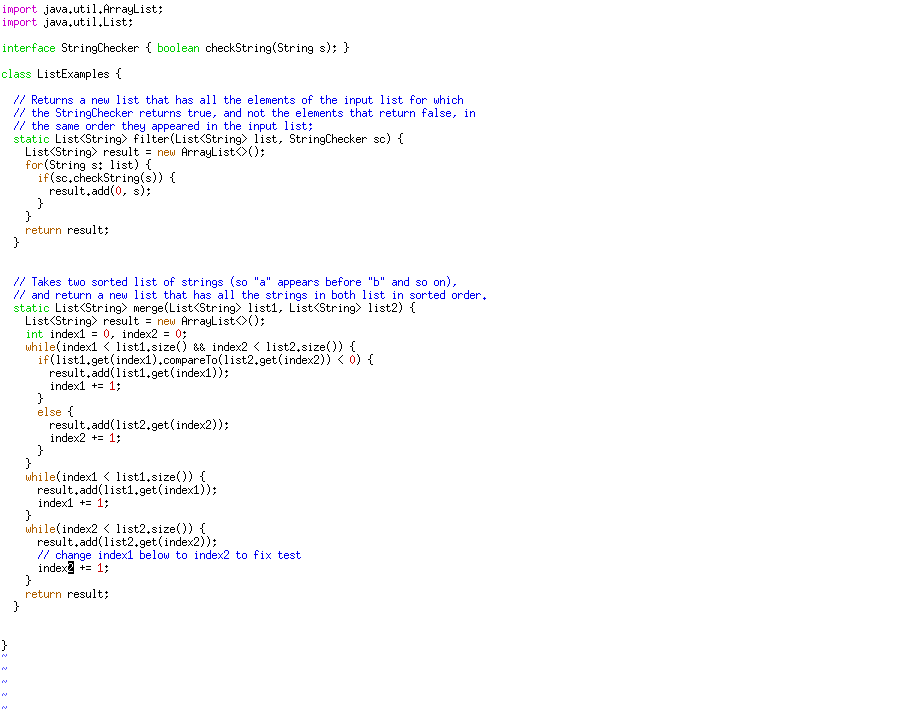
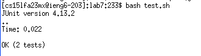
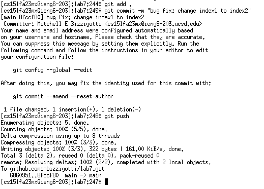

# Lab Report 4
Steps:

4. Log into ieng6
5. Clone your fork of the repository from your Github account (using the SSH URL)
6. Run the tests, demonstrating that they fail
7. Edit the code file to fix the failing test
8. Run the tests, demonstrating that they now succeed
9. Commit and push the resulting change to your Github account

# Step 4
```
ssh <space> <right> <enter>
```

I press the right arrow because on my linux computer I have the login for ieng6 saved in my shell's history, so right arrow does an auto-complete.

Then I pressed enter to run the command that logs me into the remote server, and there is no need to enter any password because I used `ssh-keygen` previously to setup the authentication key.



# Step 5
```
git <space> clone <space> <middle mouse button> <enter>
```

Before I type out this command, I first go to my forked github repository on my web browser and copy the text for an ssh clone onto my clipboard.

The middle mouse button is what is used to paste for my linux computer, so I just type the `git clone` then middle mouse button to paste what I copied from my github repository, and finally press enter to run the command.

I already had the ssh key setup for my github, so no further input was needed to clone the repositoy.



```
cd <space> lab7 <enter>
ls <enter>
```

After the repository is cloned, I type `cd lab7 <enter>` to set the working directory and `ls <enter>` to view what is in the directory.


# Step 6
```
bash <space> t <tab> <enter>
```

I see that there is a test bash script already setup, so I just type `bash t`, then a tab to autocomplete to the name of the script file then press enter to run the script.




# Step 7
```
vim <space> L <tab> .j <tab>
```

vim is the command used to edit files, then I presses "L" and tab to autocomplete to "ListExamples", then type ".j" and tab again to autocomplete to the entire filename.


## Inside vim

```
/index1 <enter> n
```

To go to the part that needed to be changed, I first type `/index1` and enter to search for index1. Then I pressed `n` a repeated number of times until I was on the the "index1" that needed to be changed.

```
e r 2 :wq <enter>
```

Then here, once I am on the "index1" that needs to be changed:
- `e` is to go to the end of the word
- `r2` replace the last character in the word to be a "2", to make the word "index2"
- `:wq <enter>` to save my changes and exit out of vim



# Step 8
```
bash <space> t <tab> <enter>
```

I do the same as in step 6, so I just type `bash t`, then a tab to autocomplete to the name of the script file then press enter to run the script.



# Step 9

```
git <space> add <space> . <enter>
```

This adds every file from the "." directory to be staged.

```
git <space> commit <space> -m <space> "bug fix: change index1 to index2" <enter>
```

Then I type `git commit` with the commit message using the `-m` option, that will create the commit.

```
git <space> push <enter>
```

Then finally `git push` is the final command I use to update the remote git repository.



Then I gave my computer a high-five. For doing so much hard work, it really just needed a high-five. Then I put my computer to sleep, because it was looking pretty tired.
