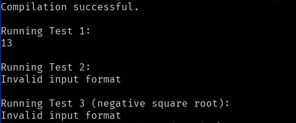

# Lab Report 5
# Part 1


## Original Post from Student

    Subject: Issue with Java Program Execution

    Hi everyone,

    I'm having trouble running my Java program. I have attached a screenshot that shows the error I'm encountering. The program is a simple calculator, and it was working fine until I added a new feature to calculate square roots. Now, whenever I try to run it, I get this weird output. I'm not sure what's causing it. Any help would be appreciated!

    [Attached Screenshot: Error_Output.png]

    Thanks,
    JavaNovice

#### Error_Output.png

#### Calculator.java
```java
import java.util.Scanner;
import java.lang.Math;

public class Calculator {
    public static void main(String[] args) {
        Scanner scanner = new Scanner(System.in);

        while (scanner.hasNextLine()) {
            String line = scanner.nextLine();
            String[] tokens = line.split(" ");

            if (tokens.length == 3) {
                int operand1 = Integer.parseInt(tokens[0]);
                String operator = tokens[1];
                int operand2 = Integer.parseInt(tokens[2]);

                int result = performOperation(operand1, operator, operand2);
                System.out.println(result);
            } else {
                System.out.println("Invalid input format");
            }
        }
    }

    private static int performOperation(int operand1, String operator, int operand2) {
        switch (operator) {
            case "+":
                return operand1 + operand2;
            case "-":
                return operand1 - operand2;
            case "*":
                return operand1 * operand2;
            case "/":
                return operand1 / operand2;
            case "sqrt":
                return (int) Math.sqrt(operand1);
            default:
                return 0;
        }
    }
}
```
## TA Response
    Subject: Re: Issue with Java Program Execution

    Hi JavaNovice,

    Thanks for reaching out. It seems like there might be an issue with the input you're providing to the program. Can you share the command you are using to run your Java program that results in this error? Also, have you recently made any changes to the input data or the program itself? 

    Additionally, you might want to try running the program with a simplified input to narrow down the issue. Let me know what you find!

    Best,
    TACodeHelper

## Student's followup
    Subject: Re: Issue with Java Program Execution

    Hi TACodeHelper,

    Thanks for your quick response. I've tried simplifying the input, but the issue persists. Here's the command I'm using to run the program:

    bash test.sh

#### test.sh
```bash
#!/bin/bash

# Compile the Java code
javac Calculator.java

# Check if compilation was successful
if [ $? -eq 0 ]; then
    echo "Compilation successful."

    # Run tests
    echo -e "\nRunning Test 1:"
    echo "4 + 9" | java Calculator

    echo -e "\nRunning Test 2:"
    echo "16 sqrt" | java Calculator

    echo -e "\nRunning Test 3 (negative square root):"
    echo "-25 sqrt" | java Calculator

    # Clean up compiled files
    rm Calculator.class

else
    echo "Compilation failed. Please fix the compilation errors before running tests."
fi
```

## TA Response
    Subject: Re: Issue with Java Program Execution

    Hi JavaNovice,

    Thank you for providing the additional information. I've identified the issue with the square root operator in your Java code. The problem lies in the way you handle the square root operation when the operand is greater than or equal to zero.

    In the `performOperation` method, the line:

    ```java
    return (int) Math.sqrt(operand2);

    This line converts the result of Math.sqrt(operand2) to an integer, effectively truncating the decimal part. This may lead to incorrect results, especially when the square root of a number is not a perfect square.

    To fix this issue, you should update the performOperation method to return a double instead of an int, and modify the corresponding print statement in the main method. Here's the corrected code snippet:


## Student's followup 2
    Subject: Re: Issue with Java Program Execution

    Hi TACodeHelper,

    I tried implementing the changes you suggested, but now the program doesn't seem to be recognizing the square root operation. I'm still getting an "Invalid input format" message even for inputs like "16 sqrt." I'm not sure what's wrong. Can you please take a look and guide me on how to fix this?

    Thanks,
    JavaNovice


## TA Response
    Subject: Re: Issue with Java Program Execution

    Hi JavaNovice,

    You're absolutely correct, and I appreciate your keen observation. The issue indeed lies in the condition `tokens.length == 3`, which doesn't accommodate the square root operation.

    To fix this, you should modify the condition to handle both binary operations and operations like square root. Here's the adjusted code snippet for the `main` method:

```java
    public static void main(String[] args) {
        Scanner scanner = new Scanner(System.in);

        while (scanner.hasNextLine()) {
            String line = scanner.nextLine();
            String[] tokens = line.split(" ");

            if (tokens.length == 3 || (tokens.length == 2 && tokens[1].equals("sqrt"))) {
                int operand1 = Integer.parseInt(tokens[0]);
                String operator = tokens[1];
                int operand2 = tokens.length == 3 ? Integer.parseInt(tokens[2]) : 0;

                double result = performOperation(operand1, operator, operand2);
                System.out.println(result);
            } else {
                System.out.println("Invalid input format");
            }
        }
    }
```

---
### The file & directory structure needed
- Calculator.java
- test.sh

### The contents of each file before fixing the bug
#### Calculator.java
```java
import java.util.Scanner;
import java.lang.Math;

public class Calculator {
    public static void main(String[] args) {
        Scanner scanner = new Scanner(System.in);

        while (scanner.hasNextLine()) {
            String line = scanner.nextLine();
            String[] tokens = line.split(" ");

            if (tokens.length == 3) {
                int operand1 = Integer.parseInt(tokens[0]);
                String operator = tokens[1];
                int operand2 = Integer.parseInt(tokens[2]);

                int result = performOperation(operand1, operator, operand2);
                System.out.println(result);
            } else {
                System.out.println("Invalid input format");
            }
        }
    }

    private static int performOperation(int operand1, String operator, int operand2) {
        switch (operator) {
            case "+":
                return operand1 + operand2;
            case "-":
                return operand1 - operand2;
            case "*":
                return operand1 * operand2;
            case "/":
                return operand1 / operand2;
            case "sqrt":
                return (int) Math.sqrt(operand1);
            default:
                return 0;
        }
    }
}
```
#### test.sh
```bash
#!/bin/bash

# Compile the Java code
javac Calculator.java

# Check if compilation was successful
if [ $? -eq 0 ]; then
    echo "Compilation successful."

    # Run tests
    echo -e "\nRunning Test 1:"
    echo "4 + 9" | java Calculator

    echo -e "\nRunning Test 2:"
    echo "16 sqrt" | java Calculator

    echo -e "\nRunning Test 3 (negative square root):"
    echo "-25 sqrt" | java Calculator

    # Clean up compiled files
    rm Calculator.class

else
    echo "Compilation failed. Please fix the compilation errors before running tests."
fi
```

### The full command line (or lines) you ran to trigger the bug
```bash
bash test.sh
```

### A description of what to edit to fix the bug
Change the main file to contain the code that the TA put in the final response.

# Part 2
Something that I learned from my experience in this course was using ssh for cloning repositories, so that it is easy to push edits to the remote repository. I always use https for git on Windows and it usually just worked, but on Linux I had installed this thing called git-credential-manager and it sucks to use. So I am happy that I learned about using ssh, there are probably lots of other tools on Linux that would make my life easier that I just don't know about unfortunatly.

# ChatGPT

Prompts given to ChatGPT:

[https://chat.openai.com/share/62e23e25-c5f0-48a8-84cf-84be4bae11e2](https://chat.openai.com/share/62e23e25-c5f0-48a8-84cf-84be4bae11e2)

The output was not really the best, but I just stitched what it did give me into a somewhat reasonable set of questions and reponses. And it did not help that the code that ChatGPT gave me did not even work, so I had to ask it to fix the code multiple times. Even then, I still had to fix an issue where it was using operand2 for the "sqrt" instead of operand1, so I changed that in the final code. I also made it so that the command line run was just `bash test.sh`.

I don't really think what I put even makes sense 😭
